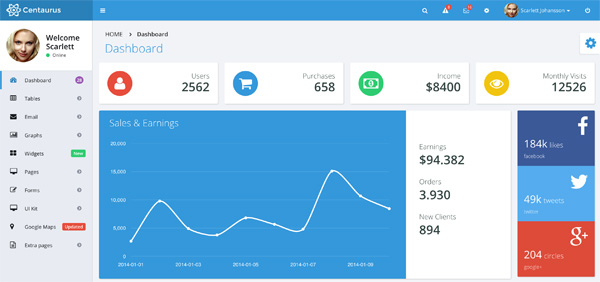

# Spécification fonctionnelle & technique (V.2)

**Application web APSO V.2**

> Ce document comporte l’ensemble des règles de fonctionnement et de l'architecture de votre application.

***

## I Introduction

**La plateforme APSO est l’outil pour organiser une élection, créer un sondage ou un vote en ligne.**

Une application qui permet crée des groupes qui a leur tour organiserait des élections, sondages ou questionnaires en temps réel. À tous moment, un citoyen peut changer sont vote et basculer le résulta final. Chaque votant est susceptible d'être élu.

* Après l'inscription de l'utilisateur, il pourra voir les groupes existants, les groupes ou il est inscrit ou ce qu'il a créé. Il peut aussi demander à rejoindre un groupe ou d'en créer un soi-même.

* Après la création d'un nouveau groupe, l'utilisateur accède à la page admin qui lui fournie des nouvelles fonctionnalités pour gérer le groupe créé précédemment.

	* Il peut gérer les acteurs qui sont inscrits à son groupe en changent leurs niveaux d'accès : guest, acteur, observateur, désactivé.
	
	* Il peut créer et ajouter des nouvelles lois, sondages ou questionnaires.
	
	* Il peut déterminer si les inscris à son groupe peuvent créer et ajouter des nouvelles lois, sondages ou questionnaires.
	
	* Il peut créer et supprimer de nouveaux mandats. Les mandats permettent d'élire un acteur à ce mandat par les autres acteurs du groupe.
	
	* Pour lui aider a géré son groupe, il pourra associer certaine fonction a des mandats, donc l'élue a ce mandat pourra accéder à certaines fonctions admin.
	
	* Il pourra recharger le compte de son groupe en payent avec paypal, si son groupe dépasse les limites choisies.

* Après l'accès a un groupe, il accède a tout son contenue et ces informations. Il peut participer en votant ou en créant son contenu.

	* Selon le choix de l'admin, il peux créer de nouvelle lois, sondage ou questionnaires. Il peut laisser les commentaires.
	
	* En tant qu'Acteur, il peut voter pour un acteur et un mandat ou une loi et un amendement.
	
	* En tant qu'observateur, il peut accéder à tout le contenu et l'historique du groupe.
	
	* En tant que désactivé, il ne peut plus voir ou accédé au groupe.
	
	* En tant que guest, il a juste un message "La demande d'accès au groupe est en attente de validation".

* L'utilisateur accède à un système de messagerie interne et crypter pour pouvoir communiquer avec tous les autres utilisateurs d'APSO.

***

## II Design

Le template choisi par le client : [centaurus](http://centaurus.adbee.technology/v5/)

Shop pour l'achat : [wrapbootstrap](https://wrapbootstrap.com/theme/centaurus-WB0CX3745)



***

## III Utilisateur

* Information demander au moment de la première connexion. Deux choix possibles.

	* Un surnom pour le côté public de l'application. Se marie parfaitement avec l'anonymat du client APSO en associant l'adresse bitcoin avec le surnom.
	
	* Le nom et prénom. No anonyme et pose un problème, car la plus par des clients rentreront des informations erronées, donc pour éviter ça, je vous conseille de demander uniquement le surnom du client.

### Fonctions et variables disponible dans le framework

> Accès au information de l'utilisateur côté jQuery, dans toutes les fonctions du framework.

#### Variables disponibles.

```js
// PassPhrase.
$.m.user.wallet.passPhrase

// Identifiant client. Address bitcoin.
$.m.user.wallet.addr

// Hash pass phrase bitcoin.
$.m.user.wallet.hash

// Private Key
$.m.user.wallet.key

// RSA object.
$.m.user.wallet.RSAkey

// RSA public key.
$.m.user.wallet.PublicKeyString
```

#### Signer un message

```js
// Init bitcoin object.
var sec = new Bitcoin.ECKey($.m.user.wallet.hash);
var key = ''+sec.getExportedPrivateKey();
var payload = Bitcoin.Base58.decode(key);
var compressed = payload.length == 38;

// Signer le message.
var sign = $.btc.sign_message(sec, 'YOUR-MESSAGE', compressed);
```

#### Decrypte message

```js
var DecryptionResult = cryptico.decrypt('MESSAGE', $.m.user.wallet.RSAkey);
```

#### Crypte message

```js
// Crypte pour un autre l'utilisateur.
var EncryptionResult = cryptico.encrypt('MESSAGE', 'clé publique du destinataire');

// Crypte pour l'utilisateur.
var EncryptionResult = cryptico.encrypt('MESSAGE', $.m.user.wallet.PublicKeyString);
```

#### Les événement déclenché par la partie utilisateur

| Event | Desc |
|-------|------|
| login | Cette événement est lancé a la connexion d'un utilisateur. |
| logout | Cette événement est lancé a la déconnexion d'un utilisateur. |

#### Ecoute des événement.

```js
$('#'+$.m.div.event).on('login', function);
$('#'+$.m.div.event).on('logout', function);
```

### Côté serveur

> Vérification de la signature électronique côté serveur par le php, dans toutes les fonctions du framework.

#### Validation de la signature

```php
// Return true or false.
valide::btc_sign($bitcoinAdresse, $message, $signature);
```

***

## IV Base de données


