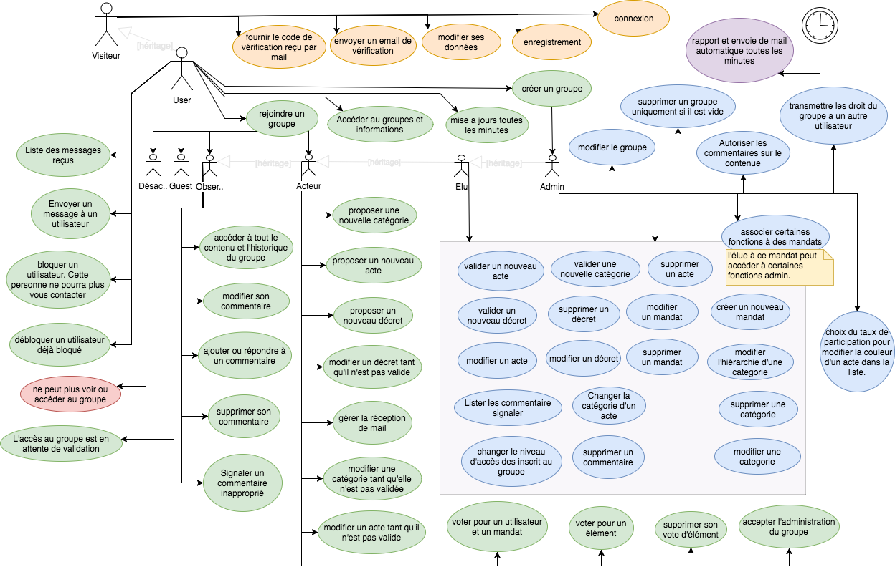

# Spécification fonctionnelle & technique (V.2)

**Application web APSO V.2**

> Ce document comporte l’ensemble des règles de fonctionnement et de l'architecture de votre application.

***

## I Introduction

**La plateforme APSO est l’outil pour organiser une élection, créer un sondage ou un vote en ligne.**

Application qui permet de créer des groupes - lesquels groupes centrés sur une fonction principale de scrutin ; qui permet de créer et voter des lois ainsiq qu'élire à des postes ou "mandats". Les Citoyens sont législateurs, créateurs et votant et tous sont susceptibles d'être élus à des postes/mandats. Ce scrutin (ou ce sondage) est recalculé en permanence et à chaque moment chaque résultat peut basculer ; les citoyens sont avertis pour un effet immédiat. Le procédé est intitulé Démocratie Flux Direct.



* Après l'inscription de l'utilisateur, il pourra voir les groupes existants, les groupes ou il est inscrit ou ceux qu'il a créé. Il peut aussi demander à rejoindre un groupe ou en créer un lui-même.

* Après la création d'un nouveau groupe, l'utilisateur accède à la page admin qui lui fournit des nouvelles fonctionnalités pour gérer le groupe créé.

	* Il peut gérer les inscrits du groupe en changeant leur niveau d'accès : guest, acteur, observateur, désactivé.
	
	* Il peut créer et ajouter des nouvelles lois, sondages ou questionnaires.
	
	* Il peut déterminer si les inscrits à son groupe peuvent créer et ajouter des nouvelles lois, sondages ou questionnaires.
	
	* Il peut créer et supprimer de nouveaux mandats. Les mandats permettent d'élire un acteur à ce mandat par les autres acteurs du groupe.
	
	* Pour lui aider a gérer son groupe, il pourra associer certaines fonctions à des mandats, donc l'élue à ce mandat peut accéder à certaines fonctions admin.

* Après l'accès a un groupe, il accède a tout son contenu et ses informations. Il peut participer en votant ou en créant son contenu.

	* Selon le choix de l'admin, il peux créer de nouvelle lois, sondage ou questionnaires. Il peut laisser des commentaires.
	
	* En tant qu'Acteur, il peut voter pour un acteur et un mandat ou une loi et un amendement.
	
	* En tant qu'observateur, il peut accéder à tout le contenu et l'historique du groupe.
	
	* En tant que désactivé, il ne peut plus voir ou accéder au groupe.
	
	* En tant que guest, il a juste un message "La demande d'accès au groupe est en attente de validation".

* L'application est gratuite pour l'utilisation du client, la facturation est baser sur la publicité.

***

## II Design

Le template choisi par le client : [centaurus](http://centaurus.adbee.technology/v5/)

Shop pour l'achat : [wrapbootstrap](https://wrapbootstrap.com/theme/centaurus-WB0CX3745)


***

## III Utilisateur

L'utilisateur entre, côté client une phrase secrétée qui génère une clé public, avec là qu'elle, il est identifié côté serveur. Si l'utilisateur doit faire une modification exigent son authentification, un message est signé côté client.
Si le client se connecte pour la première fois et n'est pas reconnu par l'api, Un formulaire lui demande de finaliser son inscription avec les information suivante :

* nom
* prénom
* email

Apres la verification de mail, un nouveau utilisateur est créer dans la base de données et les info de connexion son retourner.

### Fonctions et variables disponible dans le framework

> Accès au information de l'utilisateur côté jQuery, dans toutes les fonctions du framework.

#### Variables disponibles.

```js
// PassPhrase.
$.m.user.wallet.passPhrase

// Identifiant client. Address bitcoin.
$.m.user.wallet.addr

// Hash pass phrase bitcoin.
$.m.user.wallet.hash

// Private Key
$.m.user.wallet.key

// RSA object.
$.m.user.wallet.RSAkey

// RSA public key.
$.m.user.wallet.PublicKeyString
```

#### Signer un message

```js
// Init bitcoin object.
var sec = new Bitcoin.ECKey($.m.user.wallet.hash);
var key = ''+sec.getExportedPrivateKey();
var payload = Bitcoin.Base58.decode(key);
var compressed = payload.length == 38;

// Signer le message.
var sign = $.btc.sign_message(sec, 'YOUR-MESSAGE', compressed);
```

#### Decrypte message

```js
var DecryptionResult = cryptico.decrypt('MESSAGE', $.m.user.wallet.RSAkey);
```

#### Crypte message

```js
// Crypte pour un autre l'utilisateur.
var EncryptionResult = cryptico.encrypt('MESSAGE', 'clé publique du destinataire');

// Crypte pour l'utilisateur.
var EncryptionResult = cryptico.encrypt('MESSAGE', $.m.user.wallet.PublicKeyString);
```

#### Les événement déclenché par la partie utilisateur

| Event | Desc |
|-------|------|
| login | Cette événement est lancé a la connexion d'un utilisateur. |
| logout | Cette événement est lancé a la déconnexion d'un utilisateur. |

#### Ecoute des événement.

```js
$('#'+$.m.div.event).on('login', function);
$('#'+$.m.div.event).on('logout', function);
```

### Côté serveur

> Vérification de la signature électronique côté serveur par le php, dans toutes les fonctions du framework.

#### Validation de la signature

```php
// Return true or false.
valide::btc_sign($bitcoinAdresse, $message, $signature);
```

#### Couleur et logo du client

> Déterminer automatiquement la couleur a partir de l'adresse bitcoin et son contraste.


```php
// Récupérer les 3 premiers caractères après le 1.
$a = substr('ADDR_BTC', 1, 3);
$color = bin2hex($a);
```

##### Contraste

```php
$r = dechex(255 - hexdec(substr($color,0,2)));
$r = (strlen($r) > 1) ? $r : '0'.$r;
$g = dechex(255 - hexdec(substr($color,2,2)));
$g = (strlen($g) > 1) ? $g : '0'.$g;
$b = dechex(255 - hexdec(substr($color,4,2)));
$b = (strlen($b) > 1) ? $b : '0'.$b;
$contrast = $r.$g.$b;
```

##### CSS pour le logo

```css
div#couleur {
    height: 100px;
    width: 100px;  
    background-color: #$color;
    border-radius: 50%;
    font-size: 2.4em;
    text-align: center;
    line-height: 100px;
    color: #$contrast;
}
```

***

## IV Base de données


***

## V Api


***

## VI Application web


